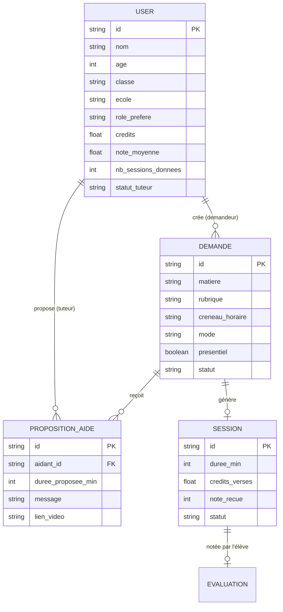

# LinkUp — Plateforme Mobile de Tutorat Scolaire entre Pairs 🎓

> **LinkUp** est une application mobile d'entraide scolaire entre pairs (collège et lycée, de la 6ᵉ à la Terminale), développée avec **React Native**, **Expo SDK 57**, et **TypeScript**.  
> Elle met en relation des élèves ayant besoin d'explications rapides avec des tuteurs certifiés issus de classes équivalentes ou supérieures.

---

## 🎯 1. Vision et Philosophie du Projet

LinkUp repose sur un principe pédagogique fondamental : **« Les grands aident les petits, et tout le monde progresse ensemble »**.

### Piliers Clés :
1. **Pédagogie active & Bienveillance** : Un élève de classe supérieure consolide ses acquis en expliquant un concept à un plus jeune.
2. **Certification par Mini-Quiz** : Pour garantir la qualité des explications, chaque tuteur doit d'abord valider un test de 3 questions sur le niveau immédiatement inférieur ($N-1$).
3. **Format d'échange direct & humain** : Aucun message texte passif — les échanges s'effectuent uniquement par **Note Vocale (Audio)** ou **Appel Vidéo** (Meet, WhatsApp, Jitsi).
4. **Valorisation au mérite & Notation** : Le gain de crédits d'un tuteur ne dépend pas du temps passé mais de la **satisfaction de l'élève aidé (Note de 1 à 5 étoiles)**.
5. **Autonomie et Flexibilité** : L'élève précise sa **plage de disponibilité d'1h** (entre 6h et 18h) et choisit librement son tuteur parmi les propositions reçues.

---

## 🏗️ 2. Architecture Technique

```
LinkUp/
├── assets/                  # Logos LinkUp, images et icônes
├── src/
│   ├── components/          # Composants réutilisables
│   │   ├── AudioWidget.tsx      # Enregistreur & Lecteur audio interactifs
│   │   ├── Badge.tsx            # Badges de matières, statuts et coefficients
│   │   ├── Button.tsx           # Boutons polymorphes avec états de chargement
│   │   ├── Card.tsx             # Cartes stylisées et conteneurs responsives
│   │   ├── KycCameraModal.tsx   # Scanner KYC interactif avec rendu instantané
│   │   ├── SuccessModal.tsx     # Modal festif animé (spring & particules)
│   │   └── TopBar.tsx           # En-tête globale avec bascule de rôles et profil
│   ├── context/
│   │   └── AppContext.tsx       # Gestion d'état global, persistance et logique métier
│   ├── data/
│   │   ├── matieres.json        # Référentiel des 9 matières, leçons et coefficients
│   │   ├── quiz_bank.json       # Banque de questions de certification par niveau
│   │   └── seed_data.ts         # Données de démonstration initiales
│   ├── screens/
│   │   ├── ActiveSessionScreen.tsx  # Suivi de la session en direct avec minuteur
│   │   ├── CreateDemandeScreen.tsx  # Formulaire de question avec créneaux et audio/vidéo
│   │   ├── DemandeDetailScreen.tsx  # Fiche détaillée, propositions et choix du tuteur
│   │   ├── DemandesListScreen.tsx   # Liste filtrée des questions + Historique requêtes
│   │   ├── ProfileScreen.tsx        # Profil élève, badges, KYC et statistiques
│   │   ├── QuizScreen.tsx           # Interface de passage des quiz de certification
│   │   ├── RatingScreen.tsx         # Évaluation 1-5 étoiles avec calcul de crédits
│   │   └── RegisterScreen.tsx       # Onboarding d'inscription en 5 étapes
│   ├── services/
│   │   └── storage.ts               # Persistance locale via AsyncStorage
│   ├── theme/
│   │   └── colors.ts                # Palette de couleurs et ombres du design system
│   ├── types/
│   │   └── index.ts                 # Définitions TypeScript et règles de calcul
│   └── utils/
│       └── kycDemoAssets.ts         # Générateur SVG de cartes scolaires démo
├── App.tsx                  # Point d'entrée principal de l'application
├── package.json
└── tsconfig.json
```

---

## 👥 3. Modèle de Données & Règles Métier



### 3.1. Hiérarchie Stricte des Classes
- Un élève de classe $C_{aidant}$ ne peut aider que des élèves de classe $C_{demandeur} \le C_{aidant}$ :
  $$\text{6e} < \text{5e} < \text{4e} < \text{3e} < \text{2nde} < \text{1ère} < \text{Terminale}$$
- **Cas particulier** : Les élèves de **Terminale** peuvent aider toutes les classes, y compris les élèves de **Terminale**.

### 3.2. Quizz de Certification Tuteur
- Avant de pouvoir voir et répondre aux demandes d'une matière, le tuteur doit réussir un test de 3 questions portant sur le niveau **immédiatement inférieur** ($N-1$).
- *Exemple* : Une élève de **3e** passe un quiz de niveau **4e** en Mathématiques pour débloquer sa certification tuteur.

### 3.3. Règle de Présentiel
- Si une demande est marquée en **Présentiel**, seuls les tuteurs appartenant au **même établissement scolaire** peuvent la voir et y postuler.

### 3.4. Calcul des Crédits basé sur la Note d'Évaluation
Les crédits ne sont plus liés à la durée, mais à la qualité de l'explication notée par l'élève :
$$\text{Crédits attribués} = \text{Base}(\text{Note}) \times \text{Coeff}(\text{Matière})$$

| Note attribuée | Base de crédits | Crédits standard ($\times 1.0$) | Crédits matières rehaussées ($\times 1.5$) |
| :---: | :---: | :---: | :---: |
| 🌟🌟🌟🌟🌟 (5/5) | **25 pts** | **+25.0 pts** | **+37.5 pts** |
| 🌟🌟🌟🌟 (4/5) | **20 pts** | **+20.0 pts** | **+30.0 pts** |
| 🌟🌟🌟 (3/5) | **15 pts** | **+15.0 pts** | **+22.5 pts** |
| 🌟🌟 (2/5) | **8 pts** | **+8.0 pts** | **+12.0 pts** |
| 🌟 (1/5) | **3 pts** | **+3.0 pts** | **+4.5 pts** |

*Coefficients rehaussés ($\times 1.5$) : Mathématiques, Physique-Chimie.*

### 3.5. Modération & Suspension Automatique
- Un tuteur subissant **3 évaluations négatives consécutives ($\le 2/5$)** ou dont la **moyenne générale passe sous $2.5/5$** est automatiquement suspendu.

---

## 📱 4. Parcours Utilisateur & Écrans

### 4.1. Processus d'Inscription en 5 Étapes (`RegisterScreen.tsx`)
1. **Écran 1 — Identité** : Nom complet, Âge (9 à 25 ans), Sélection de l'établissement parmi les 10 collèges et lycées partenaires.
2. **Écran 2 — Classe** : Sélecteur de la 6e à la Terminale alimentant la matrice d'éligibilité.
3. **Écran 3 — Points Forts** : Choix obligatoire de **2 matières fortes** qui déclenchent les suggestions de quiz tuteur.
4. **Écran 4 — Rôle Préféré** : Choix de l'orientation (*Recevoir de l'aide*, *Donner de l'aide*, ou *Les deux*).
5. **Écran 5 — KYC Scolaire Démo** : Prise de vue ou génération instantanée d'une carte scolaire / certificat de scolarité fictif au nom de l'élève, vérification visuelle et connexion automatique.

### 4.2. Création d'une Demande d'Aide (`CreateDemandeScreen.tsx`)
- **Choix de la Matière & Leçon** : Navigation interactive parmi les chapitres du programme.
- **Format Strict (Audio ou Vidéo)** :
  - *Audio* : Enregistrement de note vocale intégrée avec visualiseur de durée.
  - *Vidéo* : Détail du blocage + photo optionnelle du devoir + lien Google Meet / WhatsApp / Jitsi.
- **Créneau de Disponibilité (1h)** : Sélection d'une plage horaire d'1h entre 6h et 18h (`06h00 - 07h00`, ..., `17h00 - 18h00`).
- **Modalités** : Filtre présentiel (même école).
- **Animation de Succès** : Modal festif avec rappel du créneau et confirmation de mise en ligne.

### 4.3. Consultation des Demandes & Tri par Leçon (`DemandesListScreen.tsx`)
- **Mode Demandeur** :
  - *Sous-onglet 1 — Parcourir par matière* : Choix de la matière $\rightarrow$ Vue des questions ouvertes filtrables par leçon.
  - *Sous-onglet 2 — Historique de mes requêtes* : Suivi en direct des candidatures de tuteurs reçues, requêtes en cours, terminées ou annulées.
- **Mode Tuteur** :
  - Affichage exclusif des demandes ouvertes éligibles (classe $\le$ tuteur, quiz validé, même école si présentiel).
  - Dès qu'une demande est acceptée ou terminée, elle disparaît instantanément de la liste disponible.

### 4.4. Proposition du Temps par l'Aidant & Choix par le Demandeur (`DemandeDetailScreen.tsx`)
- **L'aidant propose le temps** : Le tuteur indique la durée qu'il estime nécessaire pour expliquer (5, 10, 15, 20, 25, 30 min) et joint un message ou un lien d'appel vidéo.
- **Le demandeur choisit son tuteur** : L'élève examine les profils des candidats (nom, classe, note moyenne, nombre de sessions, durée proposée) et valide son tuteur préféré.

### 4.5. Déroulement de la Session & Notation (`ActiveSessionScreen.tsx` & `RatingScreen.tsx`)
- **Minuteur en direct** avec boutons pause, reprise et réinitialisation.
- **Accès direct** à la note vocale ou au lien d'appel vidéo externe.
- **Écran de notation** : Vote interactif de 1 à 5 étoiles calculant en direct les crédits versés au tuteur avec animation de clôture.

---

## 📜 5. Historique Chronologique de Toutes les Modifications

```mermaid
timeline
    title Évolution et Historique des Versions LinkUp
    section V1 : Socle Initial
        Configuration Expo SDK 57 / TypeScript : Modèle de données & Rôles
        Persistance AsyncStorage : Architecture des écrans
        Synchronisation Git Remote : We-re_root
    section V2 : Formats & Historique
        Suppression du format écrit pur : Audio & Vidéo uniquement
        Historique des requêtes demandeur : Filtres de statut
        Disparition des demandes traitées : Responsive design
    section V3 : Identité Visuelle
        Intégration du logo officiel LinkUp : Thème & assets
    section V4 : Inscription & KYC
        Onboarding 5 étapes : Identité, Classe, Points forts
        Génération SVG KYC démo : Auto-login persistant
    section V5 : Flux d'Explication
        Inversion de la durée : Le tuteur propose son temps
        Sélection du tuteur par l'élève : Simulation démo instantanée
    section V6 : Crédits & Créneaux
        Crédits indexés sur la note (1-5★) : Bonus coeff x1.5
        Créneau horaire 1h (6h - 18h) : SuccessModal animée
```

### 🔹 Version 1.0 — Initialisation du Projet & Architecture Fondatrice
- Mise en place du projet React Native avec Expo SDK 57 et TypeScript.
- Création de l'arborescence standardisée (`src/components`, `src/context`, `src/screens`, `src/theme`, `src/types`, `src/utils`).
- Configuration de la persistance locale complète avec `AsyncStorage` (`StorageService`).
- Définition du référentiel scolaire des 9 matières et de la banque de questions de certification (`matieres.json`, `quiz_bank.json`).
- Connexion initiale au dépôt Git distant : `https://github.com/dainguieli/We-re_root.git`.

### 🔹 Version 2.0 — Formats Stricts, Historique & Règle d'Exclusivité
- **Suppression du format écrit pur** : L'entraide scolaire requiert un échange vivant, l'application restreint le mode à **Message Audio** et **Appel Vidéo**.
- **Composant Audio interactif** : Enregistreur vocal et lecteur audio avec timer et visualiseur de progression (`AudioWidget.tsx`).
- **Historique des requêtes soumises** : Ajout d'un onglet permettant à l'élève demandeur de suivre ses questions par état (*En attente*, *En cours*, *Terminées*, *Annulées*).
- **Règle d'exclusivité des demandes** : Une demande répondue ou en cours n'apparaît plus comme disponible pour les autres tuteurs.
- **Optimisation responsive** : Layout adaptatif centré (largeur maximale 720–760px) pour smartphone, tablette et web.

### 🔹 Version 3.0 — Intégration de la Charte Graphique & du Logo Officiel
- Intégration du logo officiel LinkUp dans les assets (`assets/logo.png`).
- Remplacement des icônes temporaires par le logo officiel dans la barre supérieure (`TopBar.tsx`), l'en-tête et les écrans de chargement.

### 🔹 Version 4.0 — Processus d'Inscription en 5 Étapes & KYC Fictif
- **Formulaire d'identité complet** : Nom, âge (entre 9 et 25 ans), et 10 établissements partenaires (Collège Sainte-Marie, Lycée Condorcet, Henri-IV, Louis-le-Grand, etc.).
- **Sélecteur de classe hiérarchique** : De la 6e à la Terminale, avec règle d'éligibilité tuteur immédiate.
- **Choix de 2 matières fortes obligatoires** : Sélection guidée orientant les futurs quiz tuteurs.
- **Rôle préféré** : Aider, Besoin d'aide, ou Les deux.
- **Module KYC Fictif** (`kycDemoAssets.ts` & `KycCameraModal.tsx`) :
  - Scanner de carte scolaire / reçu d'inscription avec simulation d'appareil photo.
  - Générateur automatique d'un document scolaire officiel en SVG vectoriel personnalisé au nom, établissement et classe de l'élève.
  - Auto-connexion directe après validation.

### 🔹 Version 5.0 — Inversion de la Logique de Durée & Choix du Tuteur
- **Seul l'aidant propose le temps** : L'élève qui demande de l'aide n'impose plus une durée arbitraire ; chaque tuteur intéressé indique le temps qu'il lui faut pour expliquer (5, 10, 15, 20, 25, 30 min) avec un message personnalisé.
- **Choix du tuteur par le demandeur** : L'élève reçoit les propositions de différents tuteurs et choisit la personne dont il souhaite recevoir les explications.
- **Bouton de simulation démo** : Possibilité de simuler instantanément la proposition d'un tuteur certifié pour tester le parcours utilisateur.

### 🔹 Version 6.0 (Version Actuelle) — Crédits à la Note, Créneau 1h & Animations Festives
- **Gain de crédits basé sur la note de l'élève** :
  - Les crédits ne sont plus définis par la durée mais par la **note (1 à 5 étoiles)** donnée par l'élève à l'explication.
  - Barème : $5\bigstar = 25\text{ pts}$, $4\bigstar = 20\text{ pts}$, $3\bigstar = 15\text{ pts}$, $2\bigstar = 8\text{ pts}$, $1\bigstar = 3\text{ pts}$ (avec bonus multiplicateur $\times 1.5$ pour Maths et Physique-Chimie).
  - Aperçu dynamique en temps réel du gain de crédits sur `RatingScreen.tsx`.
- **Créneau horaire d'1h de disponibilité (entre 6h et 18h)** :
  - L'élève demandeur précise lors de la création sa plage horaire de disponibilité parmi `06h00 - 07h00`, `07h00 - 08h00`, ..., `17h00 - 18h00`.
  - Affichage clair du badge de créneau sur les cartes de demandes et la fiche détaillée.
- **Animation de validation (`SuccessModal.tsx`)** :
  - Modal animé avec effet de ressort (*spring physics*), rotation d'étincelles/étoiles et badges de confirmation.
  - Déclenché lors de la publication d'une question, de l'envoi d'une proposition par un tuteur, et de la validation d'une note.
- **Synchronisation Git** : Commit `538610c` validé sans erreur TypeScript (`npx tsc --noEmit`) et pushé sur la branche `main` du dépôt GitHub.

---

## 🚀 6. Commandes Utiles pour le Projet

```bash
# Démarrer le serveur de développement Expo
npx expo start

# Lancer la version Web dans le navigateur
npx expo start --web

# Lancer sur Android
npx expo start --android

# Lancer sur iOS (macOS requis)
npx expo start --ios

# Vérifier la compilation TypeScript (0 erreur)
npx tsc --noEmit

# Vérifier la conformité du code
npx expo lint

# Diagnostiquer l'état du projet et des dépendances
npx expo-doctor
```

---
*Documentation générée pour le projet LinkUp — Dépôt : [dainguieli/We-re_root](https://github.com/dainguieli/We-re_root.git)*
